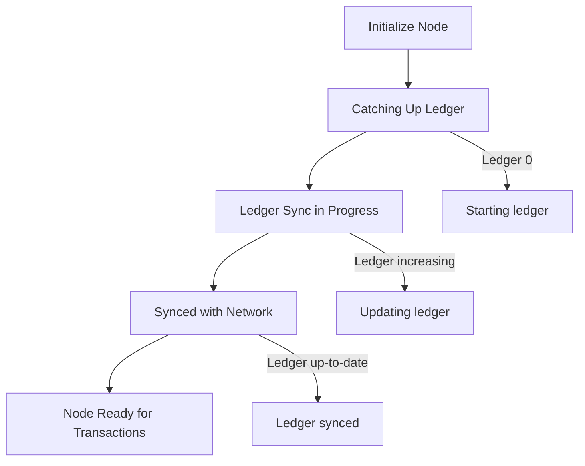

# Pi Node Ubuntu 24.04 Installer 🚀


Automatis installer untuk **Pi Node (Official Version)** di **Ubuntu 24.04 LTS**.  
Memudahkan setup node dari awal hingga siap menjalankan protokol Pi.

---

## 🔥 Status Proyek

| Component | Status |
|-----------|--------|
| Docker    |  |
| Pi Node   |  |
| Ubuntu   |  |

---

## 📦 Fitur Utama

- Install dependensi (`ca-certificates`, `curl`, `gnupg`)
- Setup Docker CE (container runtime)
- Tambahkan repository resmi Pi Network
- Instalasi Pi Node CLI resmi
- Initialize node untuk berpartisipasi dalam jaringan

---

## ⚙️ Persyaratan

- Ubuntu 24.04 LTS (amd64)  
- User dengan hak akses `sudo` atau `root`  
- Koneksi internet stabil  
- Minimal 2GB RAM (disarankan 4GB+)  
- Storage minimal 10GB  

---

## 🚀 Cara Instalasi

1. **Clone repository**

```bash
git clone https://github.com/zendshost/Pi-Node-Ubuntu-24.04.git
cd Pi-Node-Ubuntu-24.04
````

2. **Jalankan skrip instalasi**

```bash
sudo bash run.sh
```

Skrip akan otomatis:

1. Install dependensi
2. Tambah GPG key & repository Docker
3. Install Docker CE
4. Aktifkan service Docker
5. Tambah GPG key & repository Pi Network
6. Install Pi Node CLI
7. Tampilkan repo & versi
8. Initialize Pi Node

---

## 🛠️ Penggunaan

* Masuk ke folder node:

```bash
cd /root/pi-node
```

* Cek status node:

```bash
pi-node status
```

Jika berhasil, output awal akan terlihat seperti ini (node **baru**):

```
🐳 Container Status
==================
✅ Container: mainnet (Running)

⭐ Protocol Status
=================
State: Catching up
Status: Catching up to ledger 24001791: Applying buckets 7%. Currently on level 10
Ledger: 1
Quorum Ledger: 24001849

🌅 Horizon Status
=================
Status: ✅ Running
Core Latest Ledger: 1
History Latest Ledger: Not synced
Ingest Latest Ledger: Not synced

🌐 Peer Connections
==================
Incoming: 5 peers
Outgoing: 57 peers
```

---

## ⚠️ Node Baru vs Node Siap Digunakan

### Node Baru (Belum Sinkron)

* Node **belum bisa melakukan transaksi**.
* Perlu waktu **±1–2 hari** untuk menyinkronkan ledger dengan jaringan.

### Node Siap Digunakan

* Setelah sinkronisasi selesai, ledger sudah up-to-date.
* Node sekarang **siap melakukan transaksi**.

---

## 🗺️ Diagram Alur Sinkronisasi Node (GitHub-Compatible)



**Penjelasan Tahap:**

1. **Initialize Node**: Node baru di-install, ledger belum sinkron.
2. **Catching Up Ledger**: Node mulai mengunduh ledger dari jaringan.
3. **Ledger Sync in Progress**: Ledger meningkat bertahap, node belum bisa transaksi penuh.
4. **Synced with Network**: Node sudah sinkron dengan ledger terbaru jaringan.
5. **Node Ready for Transactions**: Node siap digunakan untuk transaksi.

---

## ✅ Cek Versi Pi Node

```bash
pi-node --version
```

---

## 💡 Tips

* Pastikan Docker aktif:

```bash
sudo systemctl status docker
```

* Jalankan node secara rutin agar ledger cepat sinkron.
* Gunakan user dengan hak `sudo` selama instalasi.

---

## 📜 Lisensi

Open-source, bebas digunakan dan dimodifikasi sesuai kebutuhan.

---

## 🔗 Repository

[https://github.com/zendshost/Pi-Node-Ubuntu-24.04](https://github.com/zendshost/Pi-Node-Ubuntu-24.04.git)

---

Made with ❤️ for Pi Network ZendsHost
